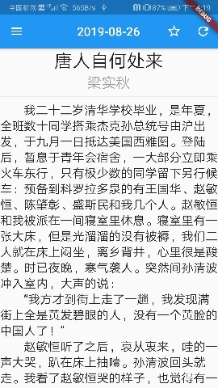
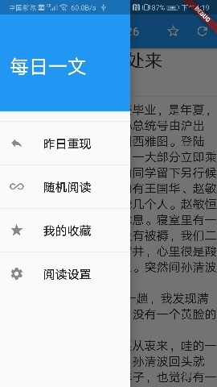

# farticle

Flutter 版本<每日一文>。

## 应用简介

每天一篇中文散文，API 来自[https://meiriyiwen.com/](https://meiriyiwen.com/)。

非商业用途，仅供学习flutter编程使用，如果侵权，请联系作者删除。

作者： 微博 @Tony_Builder

## 应用架构

可以认为是一个Flutter应用的最小系统：

- net 模块封装web api，通过 http lib获取网络数据，通过dart:convert转换为ArticleModel;
- db 模块封装了数据库访问api, 通过 sqflite lib 缓存获取的文章数据
- repo 通过repo 封装了net 和 db，ui获取数据的统一接口；实现了RAM，DB，Network的三级缓存访问机制。
- page UI层：
1. ArticlePage 主页面，呈现文章内容。支持收藏，刷新。包含drawer和bottom sheet;

  1.1 drawer 支持显示昨天文章，随机文章，收藏列表，阅读设置。
  

  1.2 昨天文章，随机文章都在主页面刷新；收藏列表打开新页面；阅读设置打开bottom sheet页面；
2. StarListPage 收藏页面，显示收藏文章列表,点击收藏文章跳转回主页面。

## 致谢
感谢每日一文常年提供美文，如有需要请支持原版APP 《观止》

